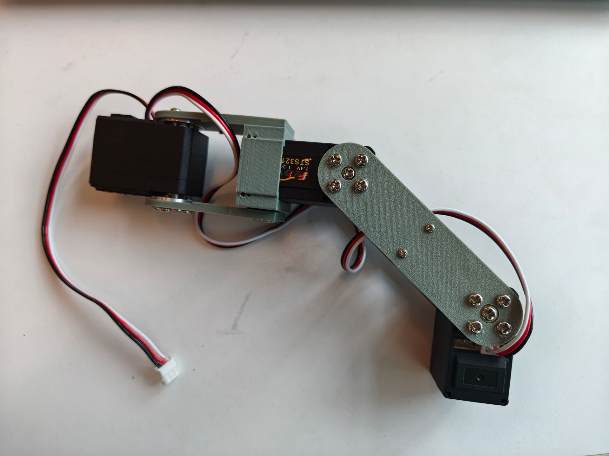
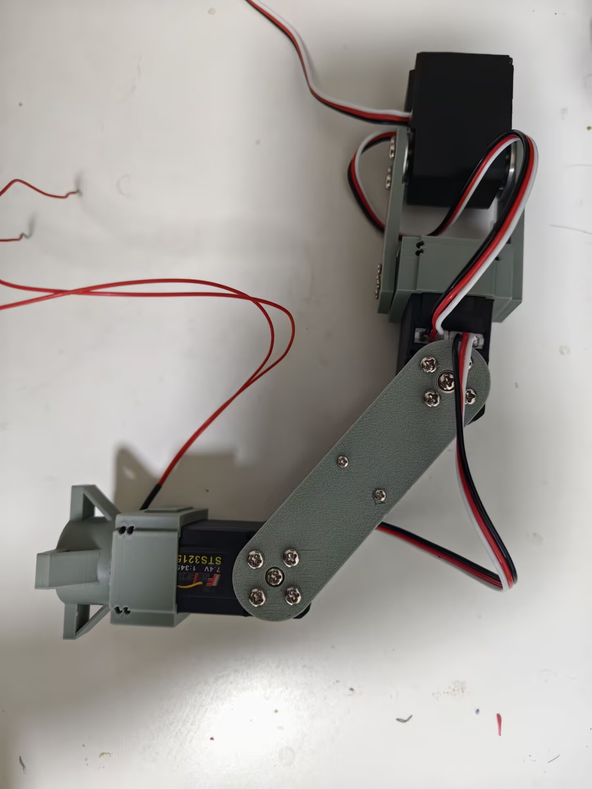
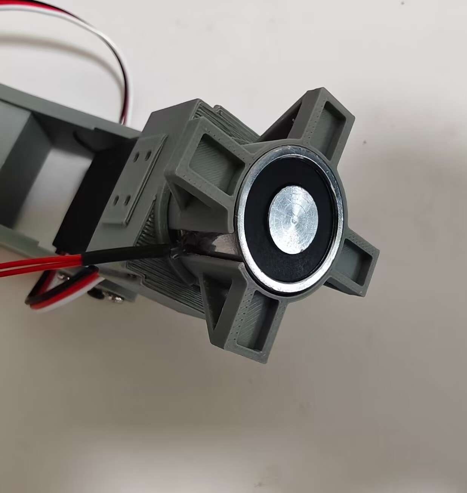

# TarantulaBot
10/6/2026 
Complete the modeling of the primary motion structure for a single leg. The 3D printing material is PLA, the compatible servo is Feetech STS3215, and each single leg is equipped with 3 servos.
完成单腿主体运动结构建模，3D 打印材料采用 PLA，适配舵机型号为飞特 STS3215，单腿配备 3 个舵机。

14/6/2026 
The foot modeling is completed and the star linkage assembly has been finished. The motion feasibility of the servos and electromagnets has been verified through testing. The complete leg and foot structures are shown in the figure below.
完成足部建模并将星简单组装，已经测试过舵机和电磁忒运动的可行性，完整的腿步结构和足部结构如下图

17/6/2026 
Completed the remote control of a single robotic leg via Orange Pi to execute designated tasks, including servo rotation and electromagnetic attraction & release. I also built a web-based control interface accessible on both mobile phones and computers to manipulate the leg’s movements remotely.
借助香橙派搭建远程控制系统，驱动单条机械腿完成舵机转动、电磁铁吸附与松开等功能。另外开发了适配手机、电脑的网页控制界面，可直接通过网页远程调控机械腿的各类动作。

